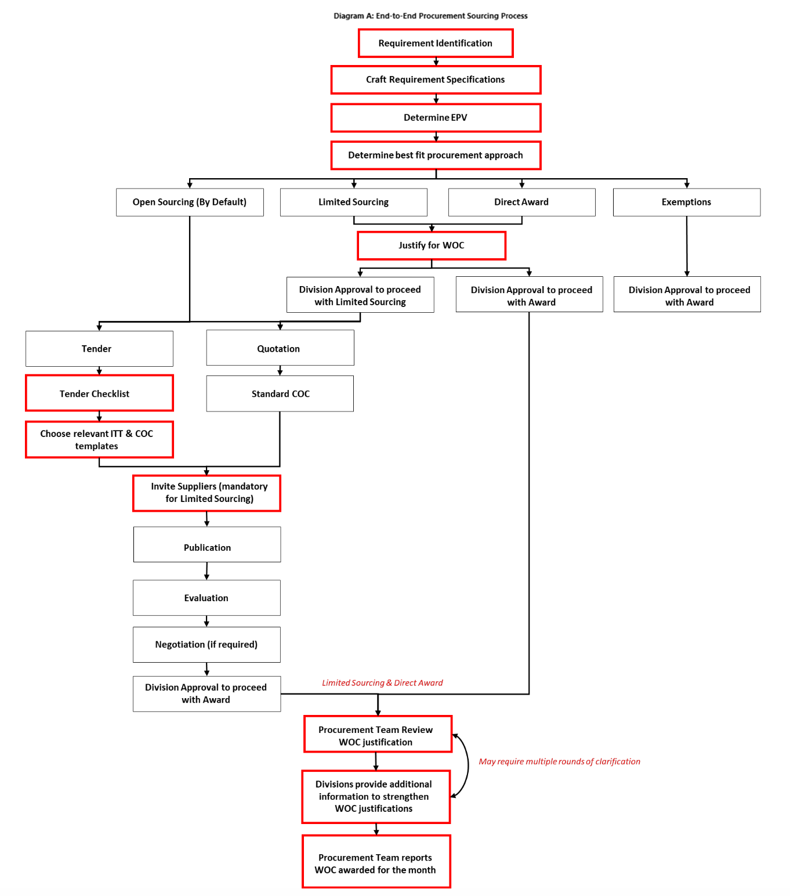

## Process diagram

## Description of the current procurement process flow

The diagram outlines an end-to-end procurement sourcing process, which is divided into several stages and decision points.

Step 1: Requirement Identification: This stage involves identifying the need for goods or services.

Step 2: Craft Requirement Specifications: Once the requirement has been identified, specific details about what is needed must be determined.

Step 3: Determine EPV (Estimated Procurement Value): The estimated value of the procurement is calculated at this stage.

Step 4: Determine best fit procurement approach: Based on the EPV, one of four approaches can be chosen:
Approach 1 - Open Sourcing (By Default)
Approach 2 - Limited Sourcing (should ahve a different WOC step from approach 3)
Approach 3 - Direct Award. Requires justification for Waiver of Competition, proceed to Step (should have a different WOC step from approach 2)
Appracoh 4 - Exemptions. Go to Step... (need to create a new step for approval -> exemptions)

Step 5: Justify for WOC (Write of Contract): Depending on the chosen approach, justification may be required to proceed with limited sourcing or direct award.

Step 6: Division Approval to proceed with Limited Sourcing / Direct Award: If limited sourcing or direct award is chosen, division approval is required to proceed.

Step 7: Tender / Quotation: Depending on the chosen approach, either a tender or quotation process will take place.

Step 8: Standard COC (Conditions of Contract): A standard contract is used if a quotation process was followed.

Step 9: Invite Suppliers (mandatory for Limited Sourcing): Suppliers are invited to participate in the procurement process.

Step 10: Publication: The procurement opportunity is published.

Step 11: Evaluation: Bids or quotations are evaluated.

Step 12: Negotiation (if required): Negotiations may occur between the buyer and supplier(s).

Step 13: Division Approval to proceed with Award: Final approval from the division is required before proceeding with the award.

Step 14: Procurement Team Review WOC justification: The procurement team reviews the justification for the write of contract.

Step 15: Divisions provide additional information to strengthen WOC justifications: Additional information may be requested by the procurement team to support the justification for the write of contract.

Step 16: Procurement Team reports WOC awarded for the month: The procurement team reports the number of write of contracts awarded for the month.

Factor this statement into an appropriate step above: It's important to note that there may be multiple rounds of clarification required throughout the process, as indicated by the arrow pointing back to step 14.
